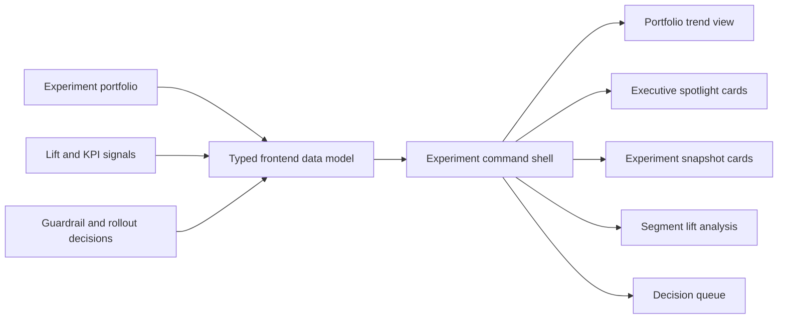
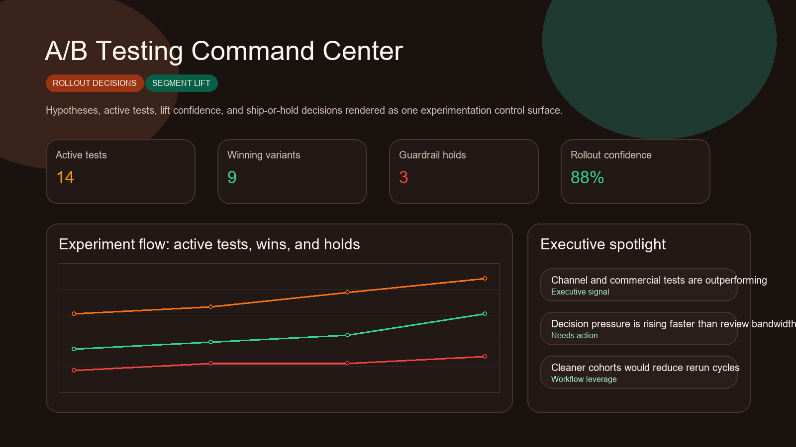
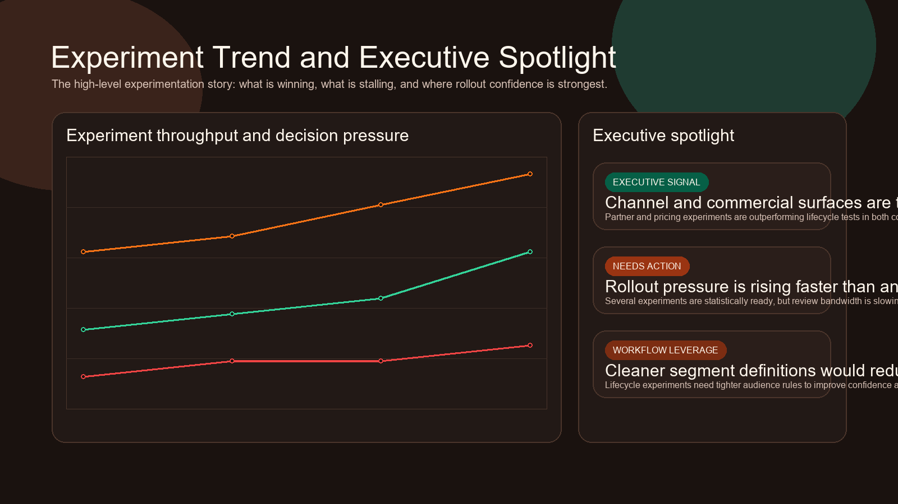
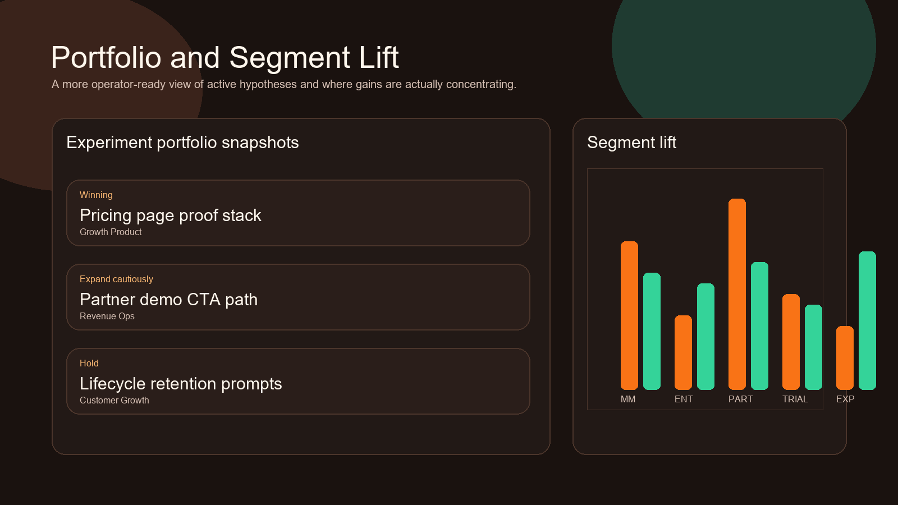
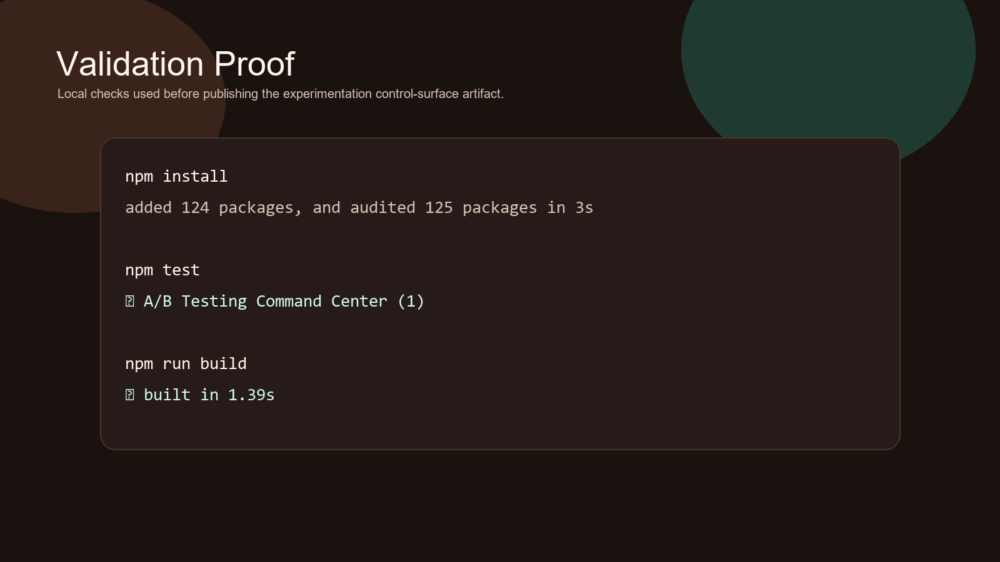

# A/B Testing Command Center

> **React + TypeScript portfolio project** demonstrating experiment portfolio visibility, segment lift interpretation, rollout decisioning, KPI guardrails, and executive-friendly experimentation workflow design.

**Recruiter takeaway:** *"This person understands experimentation as an operating system for growth decisions, not just charts about uplift."*

---

## Project Overview

| Attribute | Detail |
|---|---|
| **Frontend Stack** | React 19 + Vite + TypeScript |
| **Domain** | Experimentation, rollout decisioning, growth operations |
| **Audience** | Growth, product, lifecycle, revenue operations, executive stakeholders |
| **Signal Areas** | Variant lift · rollout confidence · segment impact · guardrail holds |
| **Portfolio Role** | Frontend proof of experimentation control-surface product thinking |
| **Validation** | Vitest + Testing Library |

---

## Executive Summary

A/B Testing Command Center is a recruiter-ready frontend project built to feel like a real internal experimentation workspace. Instead of treating experimentation as isolated charts or a stats export, it turns hypotheses, segment lift, guardrail holds, and rollout recommendations into one command surface that operators and leaders can read together.

This repo is designed to show that experimentation becomes more valuable when it helps teams decide what to ship, what to hold, and what to rerun with confidence.

---

## Business Problem

Experimentation programs break down when lift analysis, segment insights, rollout decisions, and guardrail review all live in separate places. That creates predictable failure modes:

- winning variants wait too long for decisions
- weak experiments get rerun without cleaner audience logic
- commercial and lifecycle tests compete for attention with no common queue
- leadership can see activity, but not which experiments actually deserve rollout

Teams need a control surface that translates test results into operational decisions.

---

## Solution

This project reframes experimentation as an operator-grade product surface for:

- test portfolio visibility
- segment-level lift interpretation
- guardrail and hold decisions
- rollout and rerun recommendations
- executive-readable experiment posture

---

## Architecture



### Workspace Flow

1. Teams land on one experimentation posture view.
2. Trend and spotlight sections show how fast wins are shipping and where pressure is building.
3. Experiment cards make hypotheses and confidence readable at a glance.
4. Segment lift analytics show where gains are actually concentrated.
5. The decision queue turns analysis into ship, hold, expand, or rerun actions.

---

## Screenshots

### Hero Capture



### Experiment Trend and Executive Spotlight



### Portfolio and Segment Lift



### Validation Proof



---

## Key Design Decisions

| Decision | Rationale |
|---|---|
| **Command-center framing** | Makes the repo feel like a real experimentation operating system instead of a reporting view |
| **Portfolio + queue combination** | Connects strategic overview with operational decision-making |
| **Segment-lift emphasis** | Shows the business nuance behind uplift rather than generic top-line wins |
| **Static data model** | Keeps the repo easy to run while preserving product realism |
| **Distinct experimentation visual theme** | Gives the project its own identity separate from attribution, forecasting, and AI tools |

---

## What An Engineering Leader Sees Here

- frontend execution grounded in experimentation workflow reality
- product thinking around rollout decisions, not just metrics display
- internal-tool UX that supports cross-functional growth operations
- broader portfolio credibility across growth, revenue, AI, identity, compliance, and executive systems

---

## Getting Started

### Prerequisites

- Node.js 20+
- npm

### Setup

```bash
git clone https://github.com/mizcausevic-dev/ab-testing-command-center.git
cd ab-testing-command-center
npm install
cp .env.example .env
npm run dev
```

Open:

- `http://localhost:5173`

### Run Tests

```bash
npm test
```

### Build

```bash
npm run build
```

---

## What This Demonstrates

- experimentation workflow understanding
- rollout and rerun decision product design
- executive-facing growth systems UX
- React + TypeScript delivery with production-minded repo hygiene
- portfolio range beyond backend analytics and isolated dashboards

---

## Future Enhancements

- experiment dependency mapping
- deeper cohort drilldowns
- feature-flag and phased-rollout overlays
- notes and decision-log timelines
- experiment velocity forecasting

---

## Tech Stack

[](https://react.dev/)
[](https://vite.dev/)
[](https://www.typescriptlang.org/)
[](https://recharts.org/en-US/)
[](https://vitest.dev/)
[](https://opensource.org/license/mit)

### Portfolio Links

- [LinkedIn](https://www.linkedin.com/in/mirzacausevic)
- [Skills Page](https://mizcausevic.com/skills/)
- [Medium](https://medium.com/@mizcausevic)
- [GitHub](https://github.com/mizcausevic-dev)

---

*Part of [mizcausevic-dev's GitHub portfolio](https://github.com/mizcausevic-dev) — demonstrating experimentation systems design, operator-facing rollout decisioning, and executive-readable growth workflow UX.*
