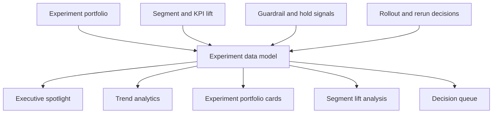

# A/B Testing Command Center Architecture

## Intent

A/B Testing Command Center is a frontend-first internal tool concept for turning experiment portfolios, segment lift, and rollout decisions into one coordinated growth operating surface.

The product is designed to help teams move faster from analysis to action without collapsing experimentation into static dashboards.

## System Flow

## Product Surfaces

- **Trend analytics**: shows experiment throughput and decision pressure
- **Executive spotlight**: translates test activity into leadership-readable signals
- **Experiment portfolio cards**: summarizes active hypotheses and confidence
- **Segment lift analysis**: reveals where wins are concentrated
- **Decision queue**: makes ship, hold, expand, and rerun work visible

## Why This Matters

This repo exists to show that experimentation is not just measurement:

- it is also prioritization
- rollout judgment
- segment interpretation
- operating cadence

That makes it a stronger portfolio signal than a generic KPI dashboard or single-chart A/B test view.
